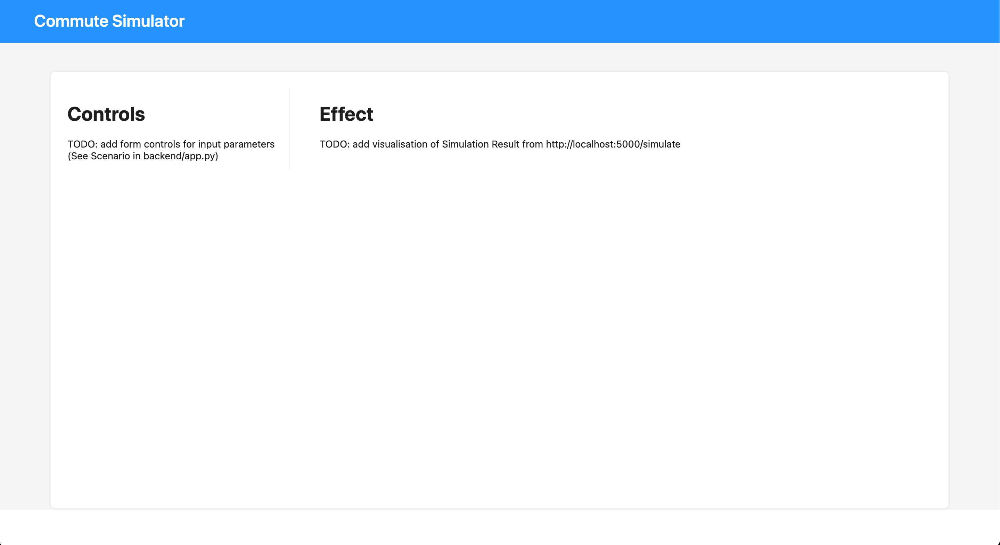

# Full Stack Coding Exercise

Employee Commuting Simulator - estimate the carbon emission associated with a different commuting options.

## Task

Implement a simple UI for an employee commuting simulator using Typescript, React, React Router and Ant Design.



A basic python API is provided in [](./backend/app.py) which you will use to simulate carbon emissions.

Examples:
```
GET http://localhost:5000/simulate?primary_mode=bus&one_way_distance=20&secondary_mode=train


GET http://localhost:5000/simulate?primary_mode=car&one_way_distance=50

```

Your solution should:

* Provide a simple, clear form input to change simulation parameters
* Provide an empty state for when you navigate to the page and no parameters are specified
* Provide a chart / visualisation of the "total_kg_co2e" by commute mode (see `SimulationResult.total_kg_co2e_per_mode` in [./backend/app.py](./backend/app.py))
* Provide a chart / visualisation of the overall "total_kg_co2e" (see [./backend/app.py](./backend/app.py))
* Gracefully handle slow API responses


### Scope

_User Story:_ As a user, I want to explore different options for traveling to work so that I understand the impacts of my choices.


## Requirements

* Handle empty state
* Handle slow responses gracefully

## Dev Setup

### Requirements

* node + npm >= v20.9.0
* python 3

### Installation


Frontend:

```
# If you use nvm, activate the correct version of node
nvm use <versino>

cd frontend/
npm install

# run the frontend server on port 5174
npm run dev

```

Backend:

```
cd backend/
python3 -m venv .venv
source .venv

pip install -r requirements.txt

# Run the server on port 5000
flask run

```
